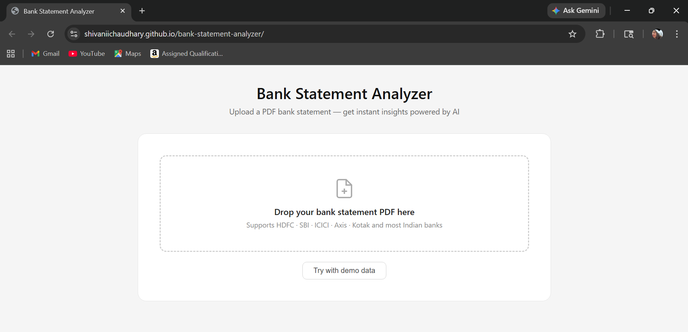

#  Bank Statement Analyzer

An AI-powered web app that reads your bank statement PDF and gives you instant financial insights — no backend, no server, runs entirely in your browser.

 **Live Demo:** https://shivaniichaudhary.github.io/bank-statement-analyzer

---

##  Preview

>


---

##  Features

-  **PDF Upload** — drag & drop any bank statement PDF
-  **AI-Powered Parsing** —  AI extracts all transactions automatically
- **Monthly Bar Chart** — visualize credits vs debits month by month
-  **Auto Categorization** — transactions sorted into Food, Rent, Shopping, Bills, Travel, Health, and more
-  **Search & Filter** — filter by date range, type, or category
-  **Smart Insights** — savings rate, biggest payee, spending trends
-  **Spending Trend Line** — see if your spending is going up or down
-  **Top Payees** — see where most of your money goes

---

##  Tech Stack

| Technology | Purpose |
|---|---|
| HTML, CSS, JavaScript | Frontend (no framework) |
| [ AI API](https://anthropic.com) | AI transaction parsing |
| [PDF.js](https://mozilla.github.io/pdf.js/) | PDF reading in browser |
| [Chart.js](https://www.chartjs.org/) | Charts and graphs |
| GitHub Pages | Free hosting & deployment |

---

##  How to Run Locally

1. Clone the repository:
   ```bash
   git clone https://github.com/shivaniichaudhary/bank-statement-analyzer.git
   cd bank-statement-analyzer
   ```

2. Get a free API key from [console.anthropic.com](https://console.anthropic.com)

3. Open `index.html` and replace the API key:
   ```js
   const API_KEY = "your-anthropic-api-key-here";
   ```

4. Open `index.html` in Chrome — no server needed!

---

##  Project Structure

```
bank-statement-analyzer/
├── index.html        # Main app (HTML + CSS + JS in one file)
└── README.md         # Project documentation
```

---

##  How It Works

1. User uploads a PDF bank statement
2. PDF.js extracts the raw text from the PDF in the browser
3. The text is sent to  Anthropic API
4. AI parses all transactions and returns structured JSON
5. The app renders charts, categories, and insights from the data

---

## Future Improvements

- [ ] Export transactions to CSV / Excel
- [ ] Support specific bank formats (HDFC, SBI, ICICI)
- [ ] Dark mode
- [ ] Monthly budget goals
- [ ] Multi-statement comparison

---

##  Author

**Shivani Chaudhary**  
GitHub: [@shivaniichaudhary](https://github.com/shivaniichaudhary)

---

## 📄 License

This project is open source and available under the [MIT License](LICENSE).